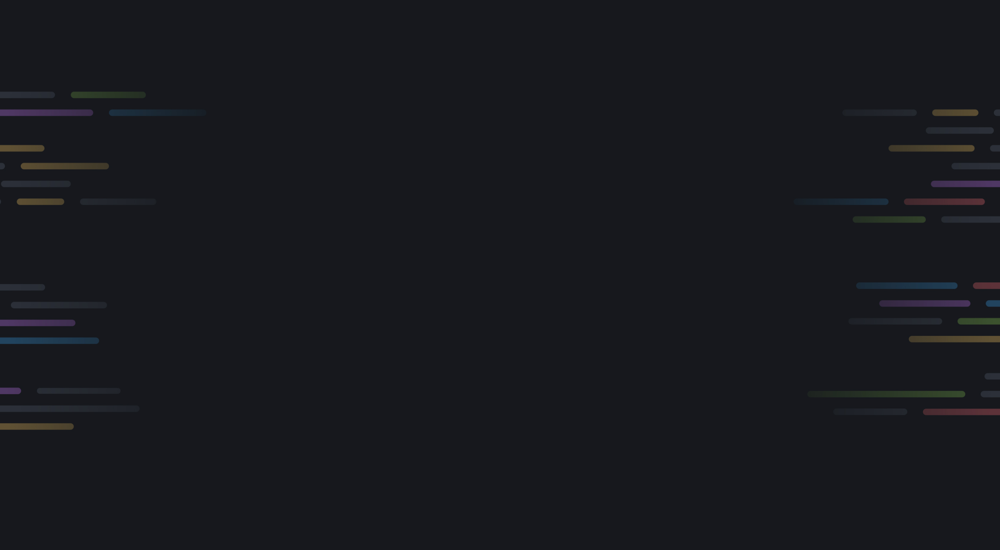

# Meu Portfólio DEV

Este é o meu portfólio profissional como desenvolvedor web. O projeto foi desenvolvido utilizando **HTML**, **CSS** e **JavaScript**, com o objetivo de apresentar minhas habilidades e projetos de forma visual e organizada.

## 🚀 Tecnologias

- HTML5
- CSS3
- JavaScript

## 🎯 Funcionalidades

- Página de introdução com imagem de fundo
- Seção de projetos
- Formulário de contato
- Design responsivo

## 🖼️ Imagens do Projeto

### Tela Inicial



### Seção de Contato


## 🔗 Acesse o projeto

[Veja o portfólio online](https://github.com/ZaaFra/Meu-Portfolio)

## 📁 Como rodar localmente

```bash
# Clone o repositório
git clone https://github.com/ZaaFra/Meu-Portfolio.git

# Acesse a pasta do projeto
cd Meu-Portfolio

# Abra o arquivo index.html no seu navegador
